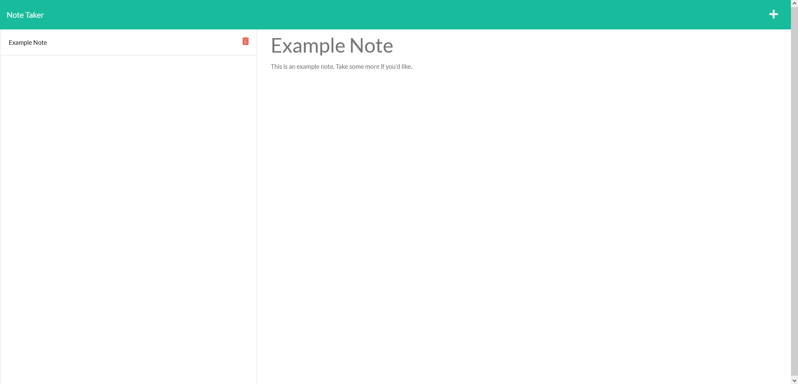

# Note Taker
## Description

This is an app that allows a user to take notes and store them persistantly for later reference.

- My motivation for making this app was to have a place that I can store notes and not worry about where I left them.
- I built this project to gain practice with using Express.js and a few other node packages.
- This app solves a problem of needing to waste paper on taking notes to reference later.
- I learned a lot about routing that solidified what I learned in class.

## Table of Contents

- [Installation](#installation)
- [Usage](#usage)
- [Credits](#credits)
- [License](#license)
- [Questions](#questions)

## Installation

N/A

## Usage

When presented with the application's home page, click on the "Get Started" button. This will take you to the main notes page. If you begin typing a Note Title and Note Text, a save button will apear. If you click the save button, it will save your note into the database and display it alongside the other notes on the left-hand column. Clicking on one of the notes on the left will pull it up into the main view. If you'd like to begin typing a new note at this point, click on the Plus button on the top right and it will clear the text fields and allow you to type a new note. If you wish to delete a note, click on the red trash can next to the note in the list.

## Credits

N/A
## License

N/A

## Tests

N/A

## Questions

If you have any questions about this project, [visit my GitHub Profile](https://github.com/TuinderJ/) or [Email Me](mailto:joshua.tuinder@gmail.com)